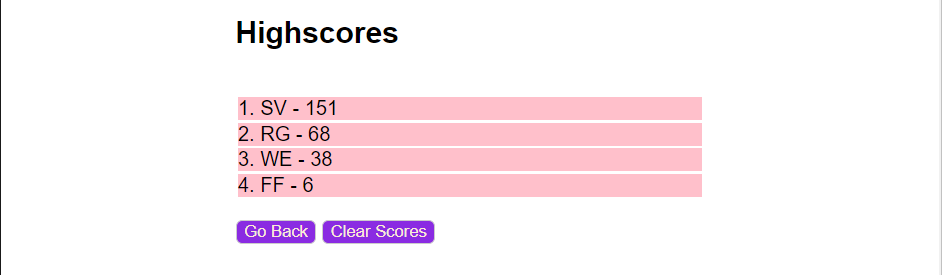

# cautious-system
04 Challenge Bootcamp

# Description
In this challenge, it is necessary to create a web quiz app from the ground up. The app should allow users to select options and as they do, the time goes up and down. At the end of the quiz, the user should receive a general score, and the score should be saved along with the user's initials into a list of scores.

## Acceptance Critetia
```
GIVEN I am taking a code quiz
WHEN I click the start button
THEN a timer starts and I am presented with a question
WHEN I answer a question
THEN I am presented with another question
WHEN I answer a question incorrectly
THEN time is subtracted from the clock
WHEN all questions are answered or the timer reaches 0
THEN the game is over
WHEN the game is over
THEN I can save my initials and my score
```
# Code Snippets
## HTML
```HTML
<!-- Navigation Bar-->
<header>
    <div id="nav">
        <h3 id="vw_hs">View Highscores</h3>
        <h3 id="vw_tm">Time:</h3>
    </div>
</header>
<!-- Start Menu  -->
<div id="start" style="display:none;">
    <h2>Coding Quiz Challenge</h2>
    <p>Try to answer the following code-related questions within the time limit. Keep in mind that incorrect answers will penalize your scoretime by ten seconds.</p>
    <button id="start_btn">Start Quiz</button>
</div>
<!-- Question Content  -->
<div id="quiz" style="display:none;">
    <h2 id="question">Question</h2>
    
    <button id="opt_1">option 1</button>
    <button id="opt_2">option 2</button>
    <button id="opt_3">option 3</button>
    <button id="opt_4">option 4</button>
    
    <div id="answer" style="display: none;">
        <hr color="grey">
        <h3 id="state">Correct!</h3>
    </div>
</div>
<!-- User Initial Input  -->
<div id="user" style="display:none;">
    <h2>All Done!</h2>
    <p id="user_score">Final Score: </p>
    <form id="initials">
        <p class="user_form">Enter initial</p>
        <input class="user_form" id="user-initial" placeholder="Enter Initials"></input>
        <button class="user_form" type="submit" id="user-submit">Submit</button>
    </form>
</div>
<!-- Highscore Board  -->
<div id="highscore" style="display:none;">
    <h2>Highscores</h2>
    <ul id="hs_list">
        
    </ul>
    <div>
        <button id="restart">Go Back</button>
        <button id="clear">Clear Scores</button>
    </div>
    <div id="isClear" style="display: none;">
        <hr color="grey">
        <h3>Cleared Scores!</h3>
    </div>
</div>
```
## CSS
```css
/* Navigation Bar */
header{
    width: 100%;
}

#nav{
    width: 100%;
    display: flex;
    flex-direction: row;
    justify-content: space-between;
}
#nav h3{
    margin: 15px 15px 0px 15px;
}
#vw_hs{
    color: blueviolet;
}
#vw_hs:hover{
    color: purple;
    cursor: pointer;
}
/* Start Menu */
#start{
    width: 50%;
    display: flex;
    justify-content: center;
    align-items: center;
    flex-direction: column;
}
#start p{
    text-align: center;
}
/* Question Content */
#quiz{
    width: 50%;
    display: flex;
    justify-content: left;
    flex-direction: column;
}
#quiz h2{
    align-self: left;
}
#quiz button{
    width: fit-content;
    align-self: left;
    margin-bottom: 15px;

}
#quiz hr{
    margin-top: 15px;
    display:block;
}
#quiz #state{
    color: grey;
}
/* User Initial Input */
#user{
    min-width: 450px;
    max-width: 40%;
    display: flex;
    justify-content: center;
    align-items: self-start;
    flex-direction: column;
}

#initials{
    display: flex;
    flex-direction: row;
    font-size: 16px;
    gap: 5px;
}
#initials p{
    margin: 0;
}
/* Highscore Board */
#highscore{
    width: 50%;
    display: flex;
    justify-content: center;
    flex-direction: column;
    align-items: self-start;
}
#highscore  ul{
    width: 100%;
    list-style:none;
    padding-inline-start: 0;
}
#highscore  ul li{
    margin: 2px;
    background-color: pink;
}
#highscore #isClear{
    width: 100%;
}
#highscore hr {
    width: 100%;
    margin-top: 15px;
    display:block;
}
```

## JS
### General Information
To switch between screens in this web app, the display of the parent element is changed from `flex` to `none` using:
* `setAttribute("style", "display:none");`
* `setAttribute("style", "display:flex");`
### Navigation Bar
The navigation bar displays two items, which are visible on every screen except for the leaderboard screen. The interaction of the navigation bar depends on two elements: the `View Highscores` and `Time:00` texts.
* The first has an event listener that triggers an action to open the Highscore screen.
* The timer displays the actual timer of the quiz. It starts when the function `start_timer()` is called, and it uses a global variable to add or subtract time depending on the answer. When the timer get to 0 it will force close the quiz sreen and display the user initial input screen and display the score.
```js
view_score.addEventListener("click", function(event){
    event.preventDefault();

    active_doc.setAttribute("style","display:none;");
    doc_highscore.setAttribute("style","display:flex;");
    doc_nav.setAttribute("style", "display:none;");

    active_doc = doc_highscore;
    render_score();
    clearInterval(scoretimer);
});
function start_timer(){
    
    scoretimer = setInterval(function () {
        if(time_score<=0){
            doc_quiz.setAttribute("style", "display:none;");
            doc_intial.setAttribute("style", "display:flex;");
            clearInterval(scoretimer)
        }else{
            view_time.textContent = "Time: "+time_score
        }         
        time_score--;
    },1000);    
}
```
### Start Quiz
The main screen is the Start Quiz screen, which only has one interactive element that:
* Hides the Start screen.
* Starts the quiz timer.
* Displays the Quiz screen.
* Starts the quiz content: `setQuestion()` function.
```js
btn_start.addEventListener("click", function (event) {
    doc_start.setAttribute("style", "display:none;");
    doc_quiz.setAttribute("style", "display:flex;");
    active_doc = doc_quiz;
    setQuestion();
    start_timer();
});
```
### Question Content
This screen displays the content of the quiz, including its options. There are different functions that interact with the quiz.

* Every option button has the same set of instructions. It checks its selected variable against the answer object, then changes the `doc_state` element, adds 10 points to the score if the answer is correct, and adds 10 seconds to the timer. After that, it displays the element that contains the state of the answer.
```js
btn_opt1.addEventListener("click", function(event){
    if(questions[0] == qs[act_q].answer){
        doc_state.textContent = "Correct!";
        score = score+10;
        time_score = time_score + 10;
    }else{
        doc_state.textContent = "Wrong :c";
        time_score = time_score - 10;
    }

    hr_state();
});
```
* The `setQuestion()` function separates the object index geting its question and options and answer, randomize the option order and displays the question and option to the quiz screen.
```js
function setQuestion(){
    var question = qs[act_q].question 
    questions = [qs[act_q].options[0], qs[act_q].options[1], qs[act_q].options[2], qs[act_q].answer];
    
    for (var i = questions.length - 1; i > 0; i--) {
        var j = Math.floor(Math.random() * (i + 1));
            
        var aux = questions[i];
        questions[i] = questions[j];
        questions[j] = aux;
      }

    doc_question.textContent = question;

    btn_opt1.textContent = questions[0];
    btn_opt2.textContent = questions[1];
    btn_opt3.textContent = questions[2];
    btn_opt4.textContent = questions[3];
}
```
* The `hr_state()` function shows the element that indicates whether the answer was correct or wrong, and holds it for two seconds. This function also has the validation for the next question or the end of the quiz. While the `act_q` variable is less than the `qs.length`, the quiz will continue. Once it reaches its limit, the else option will clear the quiz timer, swap the display from the quiz to the user initial input display, calculate the final score, and set the score to the text content of the score element.
```js
function hr_state(){
    var timeLeft = 1;
    doc_answer.setAttribute("style", "display:block;");
    var timeInterval = setInterval(function () {
        if(timeLeft==0){
            doc_answer.setAttribute("style", "display:none;");
            clearInterval(timeInterval)
        }          
        timeLeft--;
    },1000);
    act_q++;
    if(act_q<qs.length){
        setQuestion();
    }else{
        clearInterval(scoretimer);
        doc_quiz.setAttribute("style", "display:none;");
        doc_intial.setAttribute("style", "display:flex;");
        active_doc=doc_intial;
        final_score = score+time_score;
        doc_score.textContent = "Final Score: "+final_score;
    }
}
```
### User Initial Input
* The user initial input screen contains three interactive elements: the element that displays the score, the input area, and the submit button. Once the form is submitted, it will trigger its event listener, which will get the initials from the input and validate if it was completed. Then, it will retrieve the stored scores, add the new score to the list, and save it in the updated localStorage item.

* At the end, the user initial input screen will swap display with the Highscore screen, and the `render_score()` function will be called.
```js
btn_submit.addEventListener("submit", function(event){
    event.preventDefault();

    var initials = txt_intial.value.trim();
    var local_scores = final_score;
    
    if(initials!=""){
        std_scores =JSON.parse(localStorage.getItem("highscore"));

        if(std_scores==null){
            std_scores = [];
        }
        let newscore = {user_initials: initials, user_score:local_scores}
        std_scores.push(newscore);
    
    
        localStorage.setItem("highscore", JSON.stringify(std_scores));
    
        doc_intial.setAttribute("style", "display:none;");
        doc_highscore.setAttribute("style", "display:flex;"); 
        doc_nav.setAttribute("style", "display:none;");
       
        active_doc = doc_highscore;
        txt_intial.value = "";
        
        render_score();    
    }  
});
```
### HighScore Board
The Highscore Board screen has three interactive elements: the score board list and two buttons, `Go Back` and `Clear Scores`.

* The Score Board depends on the `render_score()` function. This function retrieves the list from localStorage, sorts it from greatest to least and sets the top 5 scores into the `<ul>` element ready to be filled with the score list.

* The `Go Back` button will reset the global variables to their start values and reset the time variables.

* The `Clear Scores` button will clear the localStorage content. This action shows a message at the bottom to tell the user that the content was cleared, and the `<ul>` element will be re-rendered.
```js
function render_score(){
    std_scores =JSON.parse(localStorage.getItem("highscore"));
    list_score.innerHTML="";

    if(std_scores!==null){

        var limit;
        if(std_scores.length<5){
            limit = std_scores.length;
        }else{
            limit=5;
        }
        std_scores.sort((a, b) => b.user_score - a.user_score);
        for(var i=0;i<limit ;i++){
            var aux_scores = (i+1)+". "+std_scores[i].user_initials+" - "+std_scores[i].user_score;
            
            var li = document.createElement("li");

            li.textContent = aux_scores;
            li.setAttribute("data-index", i);
            list_score.appendChild(li);   
        }  
    }   
}
function restartquiz(){
    act_q = 0;
        
    score=0;
    time_score=60;
    final_score=0;    

    view_time.textContent = "Time: "+time_score;
    clearInterval(scoretimer);
}
btn_restart.addEventListener("click", function(event){
    doc_highscore.setAttribute("style","display:none;");
    doc_start.setAttribute("style","display:flex;");
    doc_nav.setAttribute("style", "display:flex;");

    active_doc = doc_start;
    restartquiz();
});
btn_clear.addEventListener("click", function(){
    localStorage.clear();

    hr_state_clear();
    render_score();
});

```
# Screenshots
### Nagivation Bar

### Start Quiz

### Question Content

### User Initials Input

### Highscore Board


# Video

# Pages Link
Website Link [Github Pages Link](https://santis1001.github.io/cautious-system/)